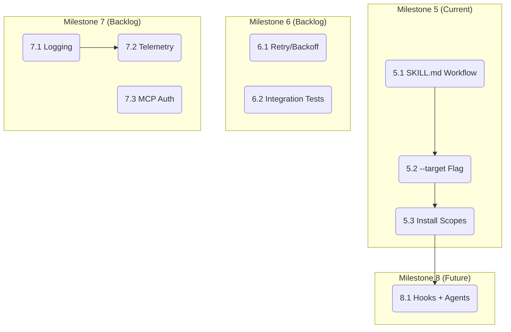

# Codify - Implementation Tasks

## Completed Milestones

### Milestone 1: Core Features (v0.1.0 - v1.2.0) ✅
- Context generation with per-file LLM streaming
- AGENTS.md standard output structure
- Spec generation (SDD) from existing context
- Multi-provider LLM (Anthropic Claude + Google Gemini)
- MCP server with stdio + HTTP transport
- Analyze command with ProjectScanner
- Locale support (en/es), `--from-file`, `--with-specs`
- BDD tests with Godog

### Milestone 2: Agent Skills (v1.3.0 - v1.12.0) ✅
- Skills command with multi-ecosystem support (claude, codex, antigravity)
- Declarative catalog with categories (architecture, testing, conventions)
- Static mode (instant, no API key) + personalized mode (LLM-adapted)
- Interactive UX (charmbracelet/huh) across all commands
- `--install` flag with global/project scopes
- MCP `generate_skills` tool
- MCP knowledge tools (commit_guidance, version_guidance)

### Milestone 3: Antigravity Workflows (v1.13.0 - v1.13.1) ✅
- Workflow catalog (separate bounded context from skills)
- Three presets: feature-development, bug-fix, release-cycle
- Static + personalized modes with Antigravity execution annotations
- CLI command with interactive UX
- MCP `generate_workflows` tool
- BDD tests (11 scenarios, 43 steps)
- Skill category rename: "workflow" → "conventions"

### Milestone 4: Distribution & CI (v1.4.0+) ✅
- Embedded templates (embed.FS)
- GoReleaser v2 cross-compilation
- Homebrew tap distribution
- GitHub Actions CI/CD

---

## Current Milestone: Claude Code Composite Workflows

### Task 5.1: Implement Option A — SKILL.md Workflow Orquestador
- **Description:** Generate a single SKILL.md file per workflow that contains procedural multi-step instructions Claude Code executes via `/workflow-name`. The skill uses Claude frontmatter (`name`, `description`, `user-invocable: true`, `allowed-tools`) and translates Antigravity annotations to natural language instructions.
- **Files to create/modify:**
  - `internal/domain/catalog/workflow_catalog.go` — Add Claude frontmatter generation
  - `internal/application/command/deliver_workflows.go` — Add Claude output format
  - `internal/infrastructure/llm/prompt_builder.go` — Add `BuildClaudeWorkflowPrompt()`
  - `internal/interfaces/cli/commands/workflows.go` — Add `--target` flag
  - `internal/interfaces/mcp/server.go` — Update `generate_workflows` tool for target
  - `templates/{en,es}/workflows/` — Add Claude-format variants or adapt existing
- **Dependencies:** None
- **Acceptance criteria:**
  - [ ] `codify workflows --preset all --target claude --mode static` generates SKILL.md files in `.claude/skills/`
  - [ ] Each SKILL.md has Claude-compatible frontmatter and multi-step instructions
  - [ ] Antigravity annotations are translated to prose instructions
  - [ ] BDD tests cover Claude target format
  - [ ] Existing Antigravity output is unchanged
- **Complexity:** MEDIUM

### Task 5.2: Add `--target` Flag to Workflows Command
- **Description:** Extend the workflows CLI command to accept `--target claude|antigravity` (default: antigravity). Interactive mode prompts for target.
- **Files to modify:** `internal/interfaces/cli/commands/workflows.go`, `internal/application/dto/workflow_config.go`
- **Dependencies:** Task 5.1
- **Acceptance criteria:**
  - [ ] `--target` flag works in CLI and interactive modes
  - [ ] `WorkflowConfig` includes Target field with validation
  - [ ] MCP tool supports target parameter
- **Complexity:** LOW

### Task 5.3: Install Scopes for Claude Workflows
- **Description:** Support `--install global` (installs to `~/.claude/skills/`) and `--install project` (installs to `.claude/skills/`) for Claude target workflows.
- **Files to modify:** `internal/interfaces/cli/commands/workflows.go`
- **Dependencies:** Task 5.2
- **Acceptance criteria:**
  - [ ] `--install global` installs to `~/.claude/skills/{workflow-name}/SKILL.md`
  - [ ] `--install project` installs to `.claude/skills/{workflow-name}/SKILL.md`
- **Complexity:** LOW

---

## Backlog: Future Milestones

### Milestone 6: Robustness & Reliability
- Retry with exponential backoff for LLM API calls
- Circuit breaker pattern for sustained outages
- Configurable timeouts for LLM requests
- End-to-end integration tests (Godog) for `generate` and `spec` flows

### Milestone 7: Production Observability
- Structured logging (slog)
- OpenTelemetry instrumentation (traces, metrics)
- MCP server authentication (OAuth/BYOK for remote deployments)
- Health check endpoints for `serve` command

### Milestone 8: Claude Code Composite Evolution (Option B)
- Generate hooks.json alongside SKILL.md for deterministic validation
- Generate agents/*.md for subagent definitions
- Package as distributable plugin directory
- Agent hooks for pre/post-phase verification

### Milestone 9: Legacy Cleanup Phase 2
- Refactor Project entity and repository (currently used only by `list` command)
- Evaluate if `list` command and in-memory repository are still needed
- Remove or refactor if obsolete

---

## Dependency Graph

## Summary

| Milestone | Status | Tasks |
|-----------|--------|-------|
| Core Features | ✅ Complete | v0.1.0 - v1.2.0 |
| Agent Skills | ✅ Complete | v1.3.0 - v1.12.0 |
| Antigravity Workflows | ✅ Complete | v1.13.0 - v1.13.1 |
| Distribution & CI | ✅ Complete | v1.4.0+ |
| **Claude Code Workflows** | **🚧 Next** | 3 tasks |
| Robustness | Backlog | TBD |
| Observability | Backlog | TBD |
| Composite Evolution | Future | TBD |
| Legacy Cleanup Phase 2 | Backlog | TBD |