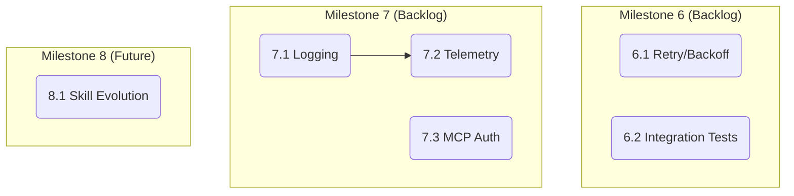

# Codify - Implementation Tasks

## Completed Milestones

### Milestone 1: Core Features (v0.1.0 - v1.2.0) ✅
- Context generation with per-file LLM streaming
- AGENTS.md standard output structure
- Spec generation (SDD) from existing context
- Multi-provider LLM (Anthropic Claude + Google Gemini)
- MCP server with stdio + HTTP transport
- Analyze command with ProjectScanner
- Locale support (en/es), `--from-file`, `--with-specs`
- BDD tests with Godog

### Milestone 2: Agent Skills (v1.3.0 - v1.12.0) ✅
- Skills command with multi-ecosystem support (claude, codex, antigravity)
- Declarative catalog with categories (architecture, testing, conventions)
- Static mode (instant, no API key) + personalized mode (LLM-adapted)
- Interactive UX (charmbracelet/huh) across all commands
- `--install` flag with global/project scopes
- MCP `generate_skills` tool
- MCP knowledge tools (commit_guidance, version_guidance)

### Milestone 3: Antigravity Workflows (v1.13.0 - v1.13.1) ✅
- Workflow catalog (separate bounded context from skills)
- Three presets: spec-driven-change (propose/apply/archive), bug-fix, release-cycle
- Static + personalized modes with Antigravity execution annotations
- CLI command with interactive UX
- MCP `generate_workflows` tool
- BDD tests (11 scenarios, 43 steps)
- Skill category rename: "workflow" → "conventions"

### Milestone 4: Distribution & CI (v1.4.0+) ✅
- Embedded templates (embed.FS)
- GoReleaser v2 cross-compilation
- Homebrew tap distribution
- GitHub Actions CI/CD

---

### Milestone 5: Claude Code Native Workflow Skills (v1.14.0 - v1.15.0) ✅
- `--target claude` on `workflows` command generates native SKILL.md files
- Frontmatter: `name`, `description`, `disable-model-invocation: true`, `allowed-tools`
- `StripAnnotationLines()` removes Antigravity execution annotations
- `BuildWorkflowSkillSystemPrompt()` for annotation-to-prose LLM generation
- `workflow-skills` mode in both providers (Anthropic + Gemini)
- Install paths: `~/.claude/skills/` (global), `.claude/skills/` (project)
- BDD tests cover Claude target format
- MCP tool supports target parameter

---

## Backlog: Future Milestones

### Milestone 6: Robustness & Reliability
- Retry with exponential backoff for LLM API calls
- Circuit breaker pattern for sustained outages
- Configurable timeouts for LLM requests
- End-to-end integration tests (Godog) for `generate` and `spec` flows

### Milestone 7: Production Observability
- Structured logging (slog)
- OpenTelemetry instrumentation (traces, metrics)
- MCP server authentication (OAuth/BYOK for remote deployments)
- Health check endpoints for `serve` command

### Milestone 8: Claude Code Skill Evolution
- Enhanced frontmatter options for workflow skills
- Conditional allowed-tools based on workflow phase
- Skill composition patterns (skill referencing other skills)

### Milestone 9: Legacy Cleanup Phase 2
- Refactor Project entity and repository (currently used only by `list` command)
- Evaluate if `list` command and in-memory repository are still needed
- Remove or refactor if obsolete

---

## Dependency Graph

## Summary

| Milestone | Status | Tasks |
|-----------|--------|-------|
| Core Features | ✅ Complete | v0.1.0 - v1.2.0 |
| Agent Skills | ✅ Complete | v1.3.0 - v1.12.0 |
| Antigravity Workflows | ✅ Complete | v1.13.0 - v1.13.1 |
| Distribution & CI | ✅ Complete | v1.4.0+ |
| Claude Code Native Skills | ✅ Complete | v1.14.0 - v1.15.0 |
| Robustness | Backlog | TBD |
| Observability | Backlog | TBD |
| Skill Evolution | Future | TBD |
| Legacy Cleanup Phase 2 | Backlog | TBD |