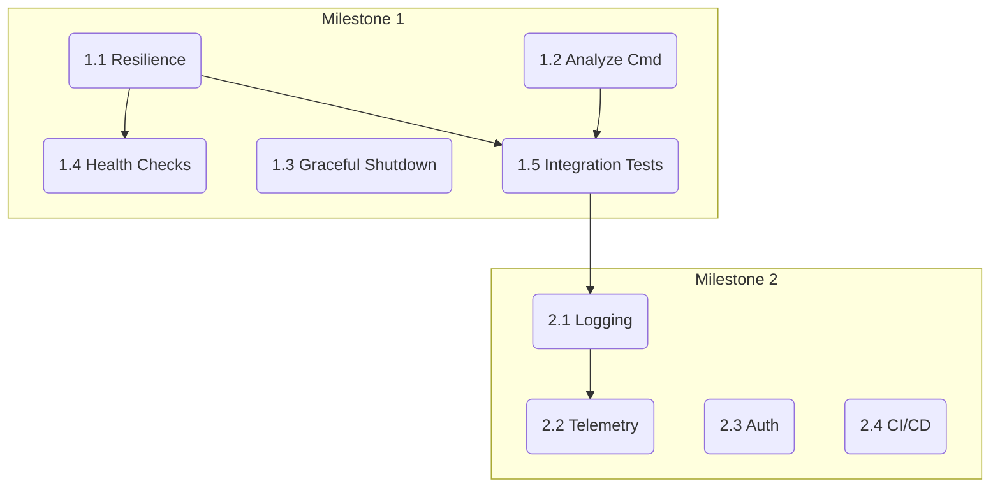

# AI Context Generator - Implementation Tasks

## Milestone 1: Robustness

### Task 1.1: Implement Resilience Patterns for LLM Clients
- **Description:** Enhance the Anthropic and Gemini LLM clients with retry-with-exponential-backoff and circuit breaker patterns to handle transient API errors gracefully.
- **Files to create/modify:** `internal/infrastructure/llm/anthropic.go`, `internal/infrastructure/llm/gemini.go`, `internal/infrastructure/llm/factory.go`
- **Dependencies:** None
- **Acceptance criteria:**
  - [ ] LLM API calls automatically retry on transient network errors or API rate limits.
  - [ ] A circuit breaker is implemented to stop sending requests for a configured period after a threshold of failures is reached.
  - [ ] Retry attempts and circuit breaker state changes (open, half-open, closed) are logged.
- **Complexity:** MEDIUM

### Task 1.2: Implement `analyze` Command
- **Description:** Create the `analyze` CLI command that uses a Project Scanner to detect the language and framework of an existing codebase. This is a foundational step for future context-aware generation.
- **Files to create/modify:** `internal/interfaces/cli/analyze.go`, `internal/application/command/analyze_project.go`, `internal/infrastructure/scanner/project_scanner.go`
- **Dependencies:** None
- **Acceptance criteria:**
  - [ ] The `analyze` command is available in the CLI.
  - [ ] When run against a directory, it outputs the detected language/framework.
  - [ ] The scanner component is unit-tested for common project types (e.g., Go, Python).
- **Complexity:** MEDIUM

### Task 1.3: Implement Graceful Shutdown for MCP Server
- **Description:** Implement graceful shutdown for the `serve` command to correctly handle `SIGINT`/`SIGTERM` signals, ensuring in-progress requests can complete before the server exits.
- **Files to create/modify:** `cmd/ai-context-generator/main.go`, `internal/interfaces/mcp/server.go`
- **Dependencies:** None
- **Acceptance criteria:**
  - [ ] The `serve` process captures `SIGINT` and `SIGTERM`.
  - [ ] Upon receiving a signal, the server stops accepting new HTTP requests.
  - [ ] The server waits for active requests to finish or until a configurable timeout expires.
- **Complexity:** MEDIUM

### Task 1.4: Implement Health Check Endpoints
- **Description:** Add `/health/live` and `/health/ready` endpoints to the MCP server for monitoring and load balancing.
- **Files to create/modify:** `internal/interfaces/mcp/server.go`, `internal/interfaces/mcp/health_handler.go`
- **Dependencies:** Task 1.1
- **Acceptance criteria:**
  - [ ] A GET request to `/health/live` returns HTTP 200 OK.
  - [ ] A GET request to `/health/ready` returns HTTP 200 OK only if external LLM APIs are reachable (when API keys are set).
- **Complexity:** LOW

### Task 1.5: Add Integration Tests for Core Flows
- **Description:** Create end-to-end BDD tests for the `generate` and `spec` commands using the Godog framework.
- **Files to create/modify:** `tests/features/generate.feature`, `tests/features/spec.feature`, `tests/godog_test.go`
- **Dependencies:** Task 1.1, Task 1.2
- **Acceptance criteria:**
  - [ ] A Godog scenario simulates running the `generate` command and verifies that the correct files are created.
  - [ ] A Godog scenario simulates running the `spec` command and verifies the output against a golden file.
- **Complexity:** HIGH

## Milestone 2: Production & Observability

### Task 2.1: Implement Structured Logging
- **Description:** Integrate a structured logger (e.g., `slog`) across the application to produce machine-readable logs.
- **Files to create/modify:** All files that currently perform logging. A new infrastructure component for the logger is recommended.
- **Dependencies:** None
- **Acceptance criteria:**
  - [ ] All log output is in JSON format.
  - [ ] Key-value pairs are used for contextual information (e.g., `command="generate"`).
  - [ ] Log levels (INFO, WARN, ERROR) are used appropriately.
- **Complexity:** MEDIUM

### Task 2.2: Add OpenTelemetry Instrumentation
- **Description:** Instrument the application with OpenTelemetry to generate traces and metrics for monitoring performance and behavior.
- **Files to create/modify:** `internal/application/command/*`, `internal/infrastructure/llm/*`, `internal/interfaces/cli/*`
- **Dependencies:** Task 2.1
- **Acceptance criteria:**
  - [ ] Traces are created for each command execution, with spans for major operations like LLM calls and file I/O.
  - [ ] Trace IDs are included in structured logs for correlation.
  - [ ] Metrics for token usage, generation duration, and error rates per model are exported.
- **Complexity:** HIGH

### Task 2.3: Implement MCP Server Authentication
- **Description:** Add a mandatory authentication layer to the MCP server to secure its endpoints. The exact mechanism is to be defined.
- **Files to create/modify:** `internal/interfaces/mcp/server.go`, `internal/interfaces/mcp/auth_middleware.go`
- **Dependencies:** None
- **Acceptance criteria:**
  - [ ] Unauthenticated requests to MCP server endpoints are rejected with an appropriate HTTP status code.
  - [ ] A valid authentication method ([DEFINE: e.g., Bearer token, API key header]) grants access.
- **Complexity:** MEDIUM

### Task 2.4: Create CI/CD Pipeline
- **Description:** Set up a CI/CD pipeline using Taskfile and a CI provider (e.g., GitHub Actions) to automate testing, linting, and release builds.
- **Files to create/modify:** `.github/workflows/ci.yml` (or equivalent)
- **Dependencies:** None
- **Acceptance criteria:**
  - [ ] The pipeline automatically runs `task lint` and `task test` on every push to `develop`.
  - [ ] Merges to `main` trigger a build of release binaries.
- **Complexity:** MEDIUM

---

## Dependency Graph

## Summary

| Milestone | Tasks | Total Complexity |
|-----------|-------|------------------|
| Robustness | 5 | 2x HIGH, 2x MEDIUM, 1x LOW |
| Production & Observability | 4 | 1x HIGH, 3x MEDIUM |

**Total tasks:** 9